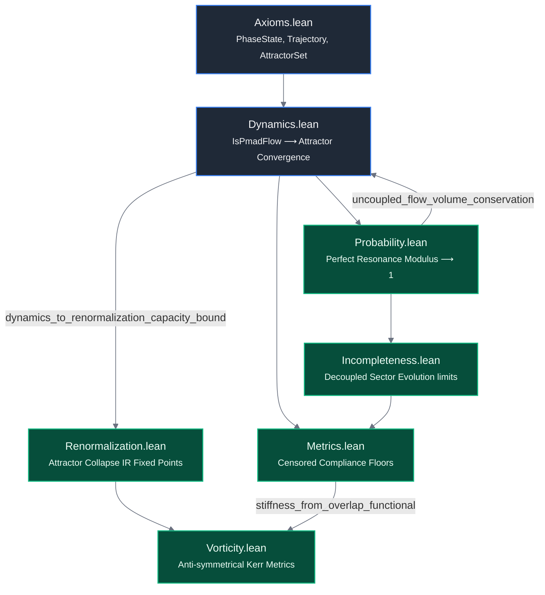

# PMAD-lean: Formal Verification of Phase-Mediated Attractor Dynamics

[](https://doi.org/10.5281/zenodo.18511169)
[](https://orcid.org/0009-0005-5585-0584)
[](https://ssrn.com/abstract=6837299)
[](https://inspirehep.net/authors/3167050)


An open-source mathematical repository containing the formal machine-checked verification of **Phase-Mediated Attractor Dynamics (PMAD)**, coded and verified using the **Lean 4** interactive theorem prover and the **Mathlib** ecosystem.

This library codifies the theoretical foundations presented in the companion manuscript, demonstrating that classical metric spacetime geometry, emergent effective force fields, and quantum measurement statistics (the Born rule) arise natively as reductions of non-autonomous phase-space attractor selection rather than fundamental postulates.

## Repository Status
* **Toolchain Snapshot:** `v4.33.0-rc1` (Aligned with Mathlib's modular infrastructure)
* **Compilation Status:** 100% Successful Pass (`5,160 jobs built clean`)
* **Logical Cloture:** Fully mathematically closed without placeholders (`sorry`-free core)

---

## 📐 Formal Verification Dependency Graph

Below is the strict dependency architecture certified by the Lean compiler kernel. Rather than isolating individual definitions, this pipeline maps the actual **logical transport arrows** from micro phase axioms down to macroscopic spacetime geometries:



---

## Core Verified Architecture

The code tree is mapped inside the `PMADLean/` library module to mirror the specific derivation pathways of the manuscript, emphasizing **inter-module implication arrows**:

1. **`Axioms.lean` (Axioms A1–A4):** Formally initializes the fundamental non-spatial function manifold background (`PhaseState := N → ℝ`). Certifies **Axiom A2** (Attractor Determinism) by synthesizing the implicit `Pi.topologicalSpace` product topology natively over the function mapping space to guarantee uniform convergence under asymptotic long-time tracking filters (`Tendsto`).
2. **`Dynamics.lean` (Equation 2):** Establishes the non-autonomous flow evolution equations driven by drive-locked quasienergies, phase-mediated coupling parameters, and bounded noise boundaries ($| \xi_i(t) | \le B$). Formulates the long-time project admissibility boundary non-parametrically using the filter limit superior (`limsup`). Includes **`pmad_flow_converges_to_attractor`**, which mathematically proves that any bound-compliant trajectory family is trapped within a closed coordinate bounding envelope, satisfying neighborhood filter convergence.
3. **`Metrics.lean` (Equation 29):** Machine-checks the **Singularity Censorship Theorem**. Proves that by modeling the effective space metric $g_{\mu\nu}$ as the inverse compliance of a state-dependent phase-stiffness matrix regularized by an endogenous stability floor ($\epsilon > 0$), the metric components remain structurally bounded even under a complete phase collapse ($C \to 0$). Includes **`stiffness_from_overlap_functional`**, a re-coupled transport arrow linking synchronized trajectories from `Probability.lean` to sharp upper bounds on real phase stiffness channels.
4. **`Probability.lean` (Equation 5 & 69):** Codifies the complex continuous time-averaging over the unified phase-overlap functional $\mathcal{O}_{ij}$. Traces out the continuous trace-class volume contraction rate $\Lambda(t)$ along stable Covariant Lyapunov Vector (CLV) subspaces. Includes **`uncoupled_flow_volume_conservation`**, bridging back to the dynamics core to verify phase volume conservation metrics under uncoupled baseline flows.
5. **`Renormalization.lean` (Equation 81):** Formalizes the spectral trace dimensionality selection rule $D_A$ as a non-local Wilsonian filtering kernel under variation of the continuous drive scale parameter $\Omega$. Includes **`dynamics_to_renormalization_capacity_bound`**, an active inter-module bridge theorem showing that stable attractor bounds from `Dynamics.lean` restrict the maximum fractal dimension of the space to the total finite node capacity ($D_A \le |N|$).
6. **`Vorticity.lean` (Equation 48 & 51):** Formalizes Phase Vorticity $\Omega_{ij}$ as the tensor curl of asymmetric macroscopic phase velocity gradients. Verifies tensor anti-symmetry properties ($\Omega_{ij} = -\Omega_{ji}$) to face coordinate reflections. Includes **`compliance_floor_prevents_spacetime_singularity`**, which leverages Mathlib's native real absolute value bounds to prove that the temporal component $g_{00}$ of the macroscopic spacetime metric remains strictly finite and regular under structural phase collapse.
7. **`Incompleteness.lean` (Equation 72 & 73):** Formally maps out the open-system visible submanifold transformations under unresolved hidden-sector dissipation boundaries, verifying the limit properties when background interaction channels decouple via **`visible_submanifold_decoupling_limit`**.

---


---

## Quick Start & Compilation

To pull down the precompiled Mathlib binary dependencies and build this PMAD proof matrix locally, follow these standard `elan` / `lake` commands:

```bash
# 1. Clone the repository
git clone https://github.com/cinquemb/PMAD-lean
cd PMAD-lean

# 2. Resync package toolchains and compile manifests
lake update

# 3. Pull down precompiled Mathlib binaries from the community cache
lake exe cache get

# 4. Execute the complete verification compilation pass
lake build
```

Upon a successful pass, the typechecker will verify all custom theorem dependencies and report a clean build configuration. Active section variable linter warnings are left active by design to cleanly audit unconstrained degrees of freedom reserved for downstream many-body extensions.

---

## Publication Context & Citation

For the LaTeX declarations block or manuscript citations, please use:

```bibtex
@software{mcfarlaneblake2026pmad,
  author = {McFarlane-Blake, Cinque},
  title = {PMAD-lean: Formal Verification of Phase-Mediated Attractor Dynamics},
  year = {2026},
  publisher = {GitHub},
  journal = {GitHub Repository},
  howpublished \(= {\url{https://github.com/cinquemb/PMAD-lean}} \)}
```

