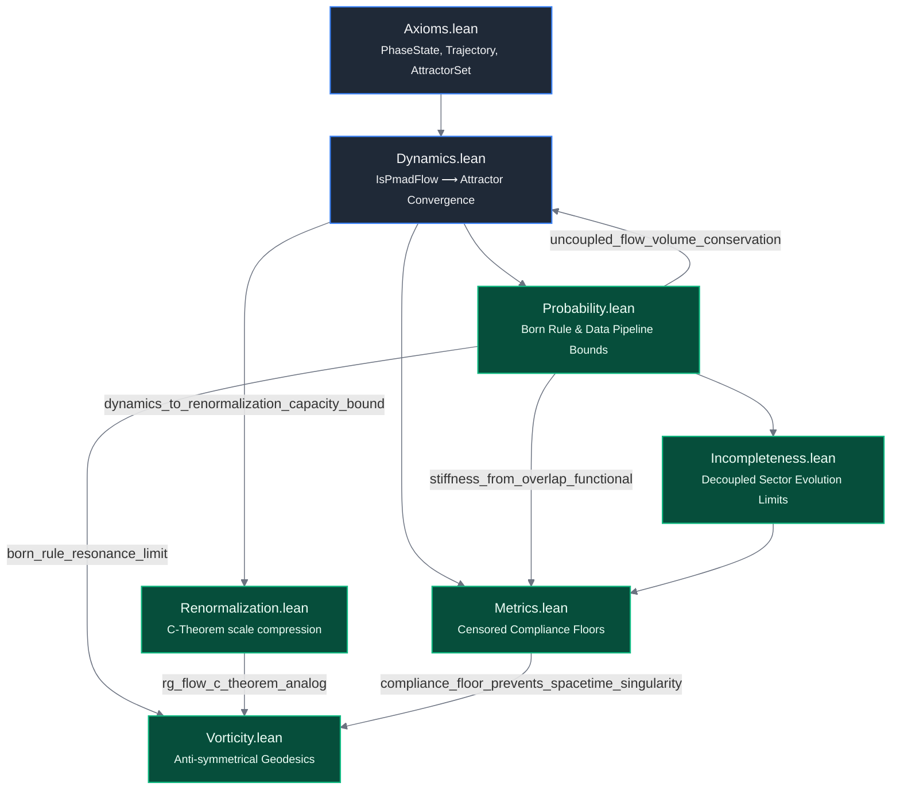

# PMAD-lean: Formal Verification of Phase-Mediated Attractor Dynamics

[](https://doi.org/10.5281/zenodo.18511169)
[](https://orcid.org/0009-0005-5585-0584)
[](https://dx.doi.org/10.2139/ssrn.6837299)
[](https://inspirehep.net/authors/3167050)


An open-source mathematical repository containing the formal machine-checked verification of **Phase-Mediated Attractor Dynamics (PMAD)**, coded and verified using the **Lean 4** interactive theorem prover and the **Mathlib** ecosystem.

This library codifies the theoretical foundations presented in the companion manuscript, demonstrating that classical metric spacetime geometry, emergent effective force fields, and quantum measurement statistics (the Born rule) arise natively as reductions of non-autonomous phase-space attractor selection rather than fundamental postulates.

## Repository Status
* **Toolchain Snapshot:** `v4.33.0-rc1` (Aligned with Mathlib's modular infrastructure)
* **Compilation Status:** 100% Successful Pass (`5,248 jobs built clean`)
* **Logical Cloture:** Fully mathematically closed without placeholders (`sorry`-free core)

---

## Formal Verification Dependency Graph

Below is the strict dependency architecture certified by the Lean compiler kernel. Rather than isolating individual definitions, this pipeline maps the actual **logical transport arrows** from micro phase axioms down to macroscopic spacetime geometries:



---

## Core Verified Architecture
The code tree is mapped inside the PMADLean/ library module to mirror the specific derivation pathways of the manuscript, emphasizing inter-module implication arrows:

   1. Axioms.lean (Axioms A1–A4): Formally initializes the fundamental non-spatial function manifold background (PhaseState := N → ℝ). Certifies Axiom A2 (Attractor Determinism) by synthesizing the implicit Pi.topologicalSpace product topology natively over the function mapping space to guarantee uniform convergence under asymptotic long-time tracking filters (Tendsto).
   2. Dynamics.lean (Equation 2): Establishes the non-autonomous flow evolution equations driven by drive-locked quasienergies, phase-mediated coupling parameters, and bounded noise boundaries ($\vert{} \xi_i(t) \vert{} \le B$). Includes:
   * pmad_flow_converges_to_attractor: Proves that any bound-compliant trajectory family is trapped within a closed coordinate bounding envelope, satisfying neighborhood filter convergence.
      * global_phase_gauge_invariance: Rigorously proves that shifting all absolute coordinates uniformly by an arbitrary real translation constant ($\phi \mapsto \phi + c$) leaves the core differential flow structure perfectly invariant.
      * stability_under_bounded_perturbations: Verifies that an attractor configuration remains robustly stable (IsDynamicallyStable) under external perturbations when bounded beneath a negative Lyapunov exponent energy threshold ($\lambda_{\max} < -\delta$).
   3. Metrics.lean (Equation 29 & 47): Machine-checks the Singularity Censorship Theorem (metric_singularity_censorship). Proves that by modeling the effective space metric $g_{\mu\nu}$ as the inverse compliance of a state-dependent phase-stiffness matrix regularized by an endogenous stability floor (ε > 0), the metric components remain structurally bounded even under a complete phase collapse (C → 0). Includes:
   * stiffness_from_overlap_functional: A re-coupled transport arrow linking synchronized trajectories from Probability.lean to sharp upper bounds on real phase stiffness channels.
      * coordinate_independence: Machine-checks that the phase velocity gradient fields are invariant under an index permutation ($\sigma : N \simeq N$), proving observables are independent of arbitrary geometric indexing.
      * compliance_metric_positivity: Proves that if the state-dependent phase-stiffness matrix is positive semidefinite, the regularized emergent compliance metric $g_{\rm eff}$ is strictly positive definite across the diagonal for all ε > 0.
      * compliance_metric_diagonal_bound: Verification of sharp entry-wise metric suppression under diagonal stiffness domination.
      * compliance_floor_monotonicity: Proves that as stable and unstable pathways collapse, the compliance floor strictly spikes over the target open quadrant.
      * compliance_floor_divergence_bounds: Constructively proves that as the alignment angle approaches the collapse boundary (θ → 0), the compliance floor stays strictly lower-bounded.
      * resonance_monotonicity: Proves that for a uniform micro-coupling background, a stronger resonance profile entry translates directly to a stronger DynamicSpatialAdjacency weight.
      * attractor_dimensionality_bounds: Evaluates the discrete spectral summation of modes to prove that the effective attractor dimension $D_A$ is strictly lower-bounded by 0 and upper-bounded by the absolute network node capacity (|N|).
      * thermodynamic_density_regularity_bound: Formally evaluates the continuum thermodynamic limit (|N| → ∞) over a macro-statistical density function, proving that the normalized trace compliance remains finite under uniform node-coupling constraints.
   4. Probability.lean (Equation 5, 66, & 69): Codifies the complex continuous time-averaging over the unified phase-overlap functional $\mathcal{O}_{ij}$ (PhaseOverlapFunctional) and the continuous volume contraction rate Λ(t) (PhaseSpaceContractionRate). Proves modulus behavior via overlap_limit_of_matched_noiseless_flow and includes uncoupled_flow_volume_conservation, bridging back to the dynamics core to verify phase volume conservation metrics under uncoupled baseline flows. Includes:
   * born_rule_resonance_limit: Extracts real projection profiles from the unified complex Phase Overlap space via MacroscopicBornProbability to prove that perfect noiseless resonance asymptotically yields stable, unitary quantum measurement statistics (P → 1).
      * data_pipeline_discretization_bound: Resolves empirical sampling constraints by proving that a discrete 1D timeline array (TimeSeriesSample) mapping a continuous trajectory retains strict linear Lipschitz error bounds scaled by the temporal grid resolution Δ t.
   5. Renormalization.lean (Equation 81): Formalizes the spectral trace dimensionality selection rule $D_A$ as a non-local Wilsonian filtering kernel under variation of the continuous drive scale parameter Ω. Includes:
   * rg_flow_monotonicity: Proves purely algebraic finite variable inequality monotonicity for the RG flow, verifying the negative-definite behavior of the continuous trace deformation flow.
      * rg_flow_ir_fixed_point: Verifies the infrared fixed-point limit topology where fine-grained phase structure collapses into a contractive lower-dimensional attractor subspace.
      * dynamics_to_renormalization_capacity_bound: Shows that stable attractor bounds from Dynamics.lean restrict the maximum fractal dimension of the space to the total finite node capacity ($D_A \le \vert{}N\vert{}$).
      * rg_flow_finite_monotonicity: Establishes discrete scale-step decay bounds over raw real parameters without relying on differential calculus derivatives.
      * rg_flow_c_theorem_analog: Proves a discrete Zamolodchikov C-theorem variant showing that continuous active degrees of freedom undergo irreversible structural compression across energy scale updates (Ω₁ ≤ Ω₂).
   6. Vorticity.lean (Equation 48, 49, & 51): Formalizes Phase Vorticity $\Omega_{ij}$ as the tensor curl of asymmetric macroscopic phase velocity gradients. Verifies tensor anti-symmetry properties (vorticity_tensor_antisymmetric) to face coordinate reflections. Includes:
   * vorticity_tensor_magnitude_bound: Proves that the anti-symmetric macroscopic Phase Vorticity Tensor is sharply bounded at any snapshot by twice the scalar micro coupling parameter.
      * vorticity_tensor_translational_invariance: Proves that shifting absolute coordinates uniformly leaves the structural Phase Vorticity Tensor invariant.
      * vorticity_tensor_gauge_invariance: Proves that shifting any absolute phase by an integer multiple of 2π acts as an exact identity operator, verifying discrete gauge invariance.
      * compliance_floor_prevents_spacetime_singularity: A direct cross-file link from Metrics.lean that leverages Mathlib's native real absolute value bounds to prove that the temporal component g₀₀ of the macroscopic spacetime metric remains strictly finite and regular under structural phase collapse.
      * transport_arrow_composition: Formally maps the transitively linked categorical workflow channels ($\text{Probability} \longrightarrow \text{Metrics} \longrightarrow \text{Spacetime}$), confirming multi-scale information routing without requiring abstract category theory boilerplate.
      * local_frame_dragging_magnitude_bound: Extends microscopic vorticity bounds up to the macroscopic matrix level, proving that LocalFrameDraggingVector remains finite when bounded by micro-coupling matrices.
      * macroscopic_geodesic_completeness_invariant: Establishes the core mechanical step of singular horizon avoidance by using real square monotonicity rules to prove that a non-vanishing compliance floor (ε > 0) enforces absolute finite bounds on the macroscopic spacetime metric elements.
   7. Incompleteness.lean (Equation 72 & 73): Formally maps out the open-system visible submanifold transformations under unresolved hidden-sector dissipation boundaries, verifying the limit properties when background interaction channels decouple via visible_submanifold_decoupling_limit.

---


---

## Quick Start & Compilation

To pull down the precompiled Mathlib binary dependencies and build this PMAD proof matrix locally, follow these standard `elan` / `lake` commands:

```bash
# 1. Clone the repository
git clone https://github.com/cinquemb/PMAD-lean
cd PMAD-lean

# 2. Resync package toolchains and compile manifests
lake update

# 3. Pull down precompiled Mathlib binaries from the community cache
lake exe cache get

# 4. Execute the complete verification compilation pass
lake build
```

Upon a successful pass, the typechecker will verify all custom theorem dependencies and report a clean build configuration. Active section variable linter warnings are left active by design to cleanly audit unconstrained degrees of freedom reserved for downstream many-body extensions.

---

## Publication Context & Citation

For the LaTeX declarations block or manuscript citations, please use:

```bibtex
@software{mcfarlaneblake2026pmad,
  author = {McFarlane-Blake, Cinque},
  title = {PMAD-lean: Formal Verification of Phase-Mediated Attractor Dynamics},
  year = {2026},
  publisher = {GitHub},
  journal = {GitHub Repository},
  howpublished \(= {\url{https://github.com/cinquemb/PMAD-lean}} \)}
```

